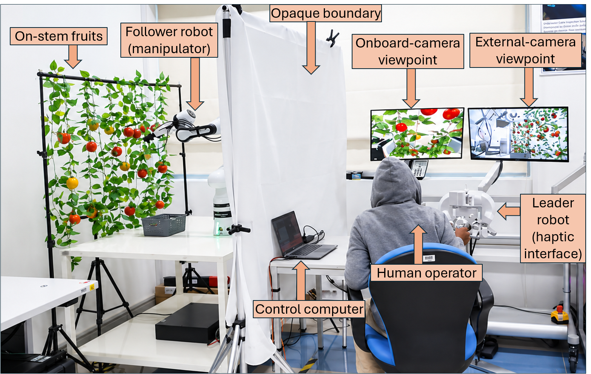

# Lambda.7–Franka FR3 ROS 2 Teleoperation

ROS 2 Humble package for velocity–velocity teleoperation between a Force
Dimension Lambda.7 haptic device and a Franka Research 3 robot. It includes
Cartesian velocity control, proximity-aware force feedback, Franka gripper
mapping, Intel RealSense D405 vision, and GelSight tactile feedback.

> **Safety:** This software can command a real robot. Start with the
> non-actuating test, use reduced limits, maintain an emergency stop, and never
> use unvalidated configuration values on a person, animal, or valuable object.

## Quick start

Full installation and safety instructions are in [docs/INSTALL.md](docs/INSTALL.md).
For the node-by-node workflow, ROS topics, calibration notes, and debugging,
see the [detailed operating guide](docs/DETAILED_OPERATING_GUIDE.md).

```bash
mkdir -p ~/ros2_ws/src
cd ~/ros2_ws/src
git clone https://github.com/ahmadbukar90/franka-lambda7-teleoperation.git lambda_franka_teleop
cd ..
source /opt/ros/humble/setup.bash
python3 -m pip install -r src/lambda_franka_teleop/requirements.txt
colcon build --symlink-install
source install/setup.bash
ros2 launch lambda_franka_teleop safe_test.launch.py
```

`safe_test.launch.py` starts only the Lambda.7 driver and the conversion node.
It publishes test commands on `/teleop_test/cmd_vel`; it does not start or move
the Franka robot. The launch file assumes the Force Dimension SDK is installed
at `~/sdk-3.17.5`. If yours is elsewhere, pass
`fd_sdk_root:=/path/to/sdk` to the launch command.

## Real-hardware launch

After the prerequisites, preflight check, and safe test have passed:

```bash
ros2 launch lambda_franka_teleop hardware.launch.py \
  robot_ip:=<ROBOT_IP> \
  start_franka:=true \
  start_gripper:=true \
  start_camera:=true \
  start_tactile:=true
```

Optional flags include `start_camera:=false`, `start_tactile:=false`, and
`start_logger:=true`. Review `config/safe_defaults.yaml` before use.

## External prerequisites

The repository includes this project's nodes only. Install separately:

- Ubuntu 22.04 and ROS 2 Humble
- Force Dimension SDK and `fd_lambda7_driver_ros2`
- Franka ROS 2 packages: `franka_bringup`, `franka_gripper`, and `franka_msgs`
- Intel RealSense SDK / `pyrealsense2`
- OpenCV, NumPy, SciPy, Pydantic, PyTorch, and `cv_bridge`
- GelSight Mini camera access

Run the preflight check after building:

```bash
bash ~/ros2_ws/src/lambda_franka_teleop/scripts/preflight.sh
```

## Complete experimental setup



*Lambda.7 haptic device, Franka Research 3 robot, RealSense D405 camera, and
GelSight tactile sensor.*

## Video demonstration

[Watch the teleoperation experiment on YouTube](https://youtu.be/siAZwTnRl4s)

## Potential application domains

This framework provides a basis for research and prototyping in precision
agriculture, medical-robotics research, and marine or subsea teleoperation.
Every deployment requires application-specific validation, safety engineering,
and human-factors evaluation.
